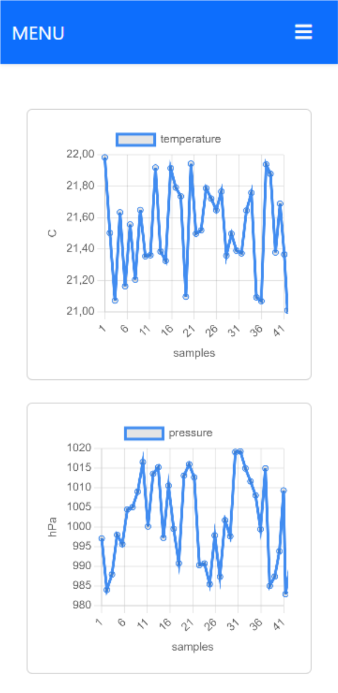
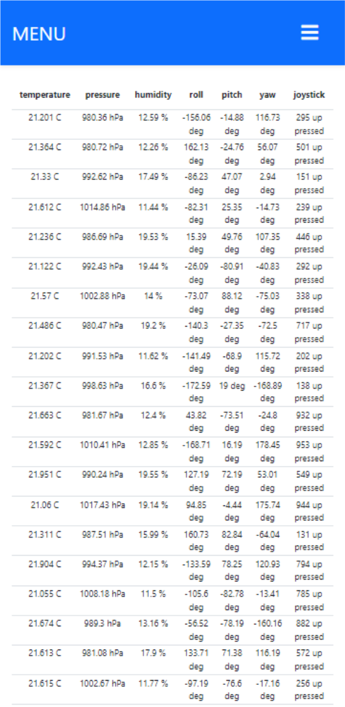
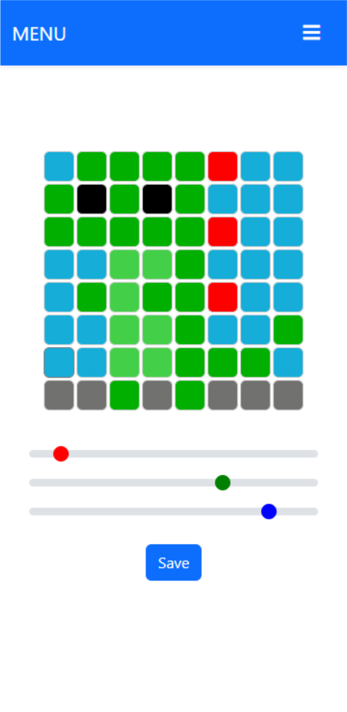
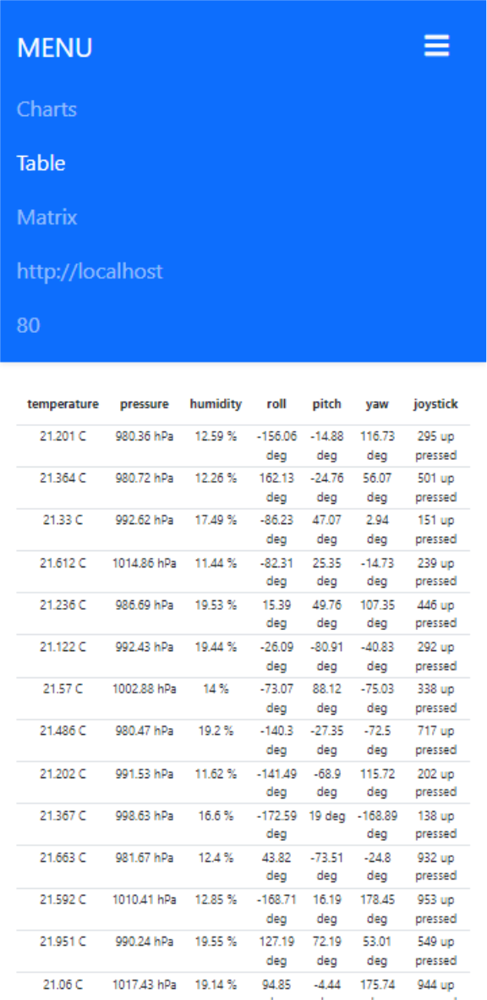

# AIR Site Project
*Warning! You should not use this code on production! This is only localhost example.*

This project is to display sensors data real time and set LEDs from Rasperry Pi Sensehat kit with API.

It show data like:
- weather
    - temperature
    - pressure
    - humidity
- orientation
    - roll
    - pitch
    - yaw
- joystick
    - timestamp
    - direction
    - action

It set color with RGB values each from 0 to 255 in point with coordinates X Y

## How to run

Open index.html in browser or run Live Server. Then write ip and port in navbar. <br> (when you use mobile/tablet you need to collapse navbar to see this option). In navbar you can change displayed info to charts, tables or matrix to set LEDs.

## UML


## Input

Json from Raspberry Pi API to display data
```
[
  {
    "temperature": {
      "value": 0.65,
      "unit": "C"
    },
    "pressure": {
      "value": 988.25,
      "unit": "hPa"
    },
    "humidity": {
      "value": 12.27,
      "unit": "%"
    },
    "roll": {
      "value": -0.19,
      "unit": "deg"
    },
    "pitch": {
      "value": -0.19,
      "unit": "deg"
    },
    "yaw": {
      "value": -0.19,
      "unit": "deg"
    },
    "joystick": {
      "timestamp": 537,
      "direction": "up",
      "action": "pressed"
    }
  }
]
```
 
## Output

### Example Output to RPi API for set LEDs

```
[
  {
    "x": 7,
    "y": 7,
    "r": 255,
    "g": 255,
    "b": 255,
  },
  {
    "x": 0,
    "y": 0,
    "r": 0,
    "g": 0,
    "b": 0,
  },
]
```

### Website Lookout

#### Mobile

<p align="middle">
  
  
</p>

<p align="middle">
  
  
</p>

#### Tablet


#### Desktop


